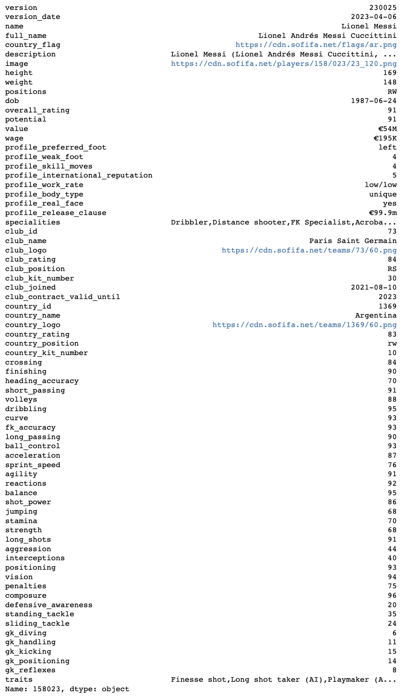

### FIFA 23 Players Data

Collected from [sofifa.com](https://sofifa.com) as of April 07, 2023.

Latest players data can be obtained by running the project locally.
To do so, follow the instructions below:

```
git clone https://github.com/prashantghimire/sofifa-web-scraper
cd sofifa.web-scraper
npm i

# to download top 60 players, useful for testing setup.
npm run download-test

# to download all the 18k players)
npm run download-all
```

The output data are in the [output](./output) directory.

#### Players Data

```
import pandas as pd
pd.read_csv('./player_data.csv', index_col=['profile_id'])
```


